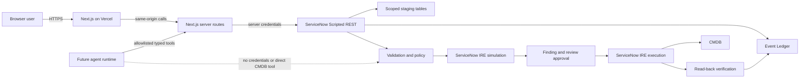

# Keystone Technical Stack And Architecture

## Document Control

**Version:** 1.0  
**Date:** 2026-07-19  
**Purpose:** Engineering companion to `docs/keystone-agentic-cmdb-prd.md`, covering the current stack, authority boundaries, integration contracts, security posture, and planned agent runtime.  
**Working product name:** Keystone.  
**Non-negotiable rule:** No production CMDB mutation outside ServiceNow IRE.

## 1. Baseline Classification

### Verified In Current `main`

- Next.js application with React and TypeScript.
- Vercel-compatible deployment configuration.
- ServiceNow compatibility proxy for `cis`, `timeline`, `relationships`, `health`, `import`, and proposal-only `remediate`.
- ServiceNow-backed Comprehend and Live Ops views.
- Single-record IRE proxy route at `app/api/cmdb/ire/[action]/route.ts` for `simulate`, `approve`, `execute`, and `verify`.
- Read-only AI usage route at `app/api/cmdb/usage/route.ts`.
- Read-only AI usage page at `app/ai-usage/page.tsx`.
- AI usage normalization helpers at `app/lib/cmdb/usage-adapter.ts`.
- Custom SVG Sankey and relationship graph.
- Six-table ServiceNow scoped-app data model documented in `docs/servicenow-schema-inventory.md`.
- Server-side environment-variable boundary for ServiceNow credentials.
- Demo data fallback when no live run is selected.
- Run-scoped Comprehend and Live Ops behavior with explicit resource status handling.

### Planned

- Single-record IRE workbench in the main Keystone UI.
- Derived Prioritize/remediation work queue.
- Deterministic failure grouping and retry.
- Provider-neutral autonomous agent harness.
- Runtime Comprehend agent-roster telemetry backed by persisted events, tool
  calls, and recorded Mara/subagent handoffs rather than static persona data.
- Large-run pagination, queueing, and background execution.

## 2. Technology Inventory

| Layer | Technology | Version/status | Purpose |
| --- | --- | --- | --- |
| Web framework | Next.js | 16.2.6 | App Router UI and server-side API routes |
| UI runtime | React | 19.2.6 | Interactive control-plane views |
| Language | TypeScript | 5.9.3 | Typed frontend, adapters, contracts, and routes |
| Runtime | Node.js | `>=22.13.0` | Build and Next.js server runtime |
| Styling | CSS and Tailwind toolchain | Tailwind 4.2.1 present | Existing UI is primarily custom CSS |
| Linting | ESLint | 9.39.4 | Static quality checks |
| Hosting | Vercel | Configured | Next.js build and deployment |
| System of record | ServiceNow scoped app | `x_kest_dotwalkers` | Staging, findings, reviews, events, IRE authority |
| CMDB write mechanism | ServiceNow IRE | Platform capability | Identification, reconciliation, governed CI mutation |
| API integration | ServiceNow Scripted REST | Current bridge | Reads, staging, proposals, IRE lifecycle, usage telemetry |
| Visualization | Native SVG/React | Current | Sankey, relationship graph, ledger charts |
| Model runtime | None verified in repo | Planned | Provider-neutral structured agent layer |
| Frontend database | None | Intentional | ServiceNow remains workflow source of truth |
| Test runner | None project-owned | Gap | `npm test` currently maps to build |

### Package Manifest

Production dependencies:

```text
next 16.2.6
react 19.2.6
react-dom 19.2.6
```

Development dependencies:

```text
typescript 5.9.3
eslint 9.39.4
eslint-config-next 16.2.6
tailwindcss 4.2.1
@tailwindcss/postcss 4.2.1
@types/node 22.19.19
@types/react 19.2.14
@types/react-dom 19.2.3
```

The stack deliberately avoids a chart library, client state library, frontend database, queue framework, and model SDK until a concrete requirement justifies them.

## 3. Runtime Architecture



### Authority Split

Browser may:

- select a migration run;
- preview source data;
- request reads;
- submit staging inputs;
- request proposals and simulation;
- submit a human decision;
- request approved execution and verification using identifiers.

Browser may not:

- hold ServiceNow credentials;
- build authoritative IRE payloads;
- set final operation, target class, target CI, or CMDB attributes;
- write directly to CMDB.

Next.js server responsibilities:

- same-origin API gateway;
- server-side credentials;
- route allowlists;
- request validation and sanitization;
- compatibility normalization;
- safe error handling;
- future model-provider isolation.

Next.js is not the authoritative CMDB policy engine.

ServiceNow is authoritative for:

- authentication and roles;
- run and staged-record membership;
- staging persistence;
- class and attribute allowlists;
- findings and review decisions;
- IRE payload rebuild;
- simulation fingerprint;
- idempotency and execution locking;
- IRE execution;
- Event Ledger persistence;
- actual CI read-back and verification.

Future agent runtime may reason over sanitized data and call allowlisted tools. It has no credentials, generic query access, approval authority, or direct CMDB write capability.

## 4. Frontend Architecture

| File | Responsibility |
| --- | --- |
| `app/page.tsx` | Application entry |
| `app/cmdb-dashboard.tsx` | Main shell, navigation, data loading, Comprehend/Prioritize/Remediate composition |
| `app/import-view.tsx` | Intake UI, local preview, public source starters, staging request |
| `app/live-view.tsx` | Event Ledger visualization and Agent Board |
| `app/hr-view.tsx` | Legacy agent persona surface; the live demo roster is rendered in Comprehend from persisted evidence |
| `app/ai-usage/page.tsx` | Read-only per-run AI usage telemetry |
| `app/agents-data.ts` | Current static agent persona data |
| `app/cmdb-data.ts` | UI contracts and demo fixtures |
| `app/globals.css` | Visual system and responsive behavior |
| `app/icons.tsx` | Local icon components |

Current dashboard state is held in React component state. The dashboard owns active section, active run, API state, resource status, normalized CIs, timeline, relationships, health, filters, selected CI/provenance drawer, playback position, Live Ops polling state, and proposal/remediation UI state.

This is acceptable for the current single-page scale. Introduce a state library only when cross-route orchestration or durable queue complexity proves it necessary.

### Visualization

The Sankey and relationship graph are custom React-rendered SVG. This keeps dependencies low and allows exact visual control. Graph nodes should be keyed by staged-record ID/sys_id, not display name. Display-name fallback is acceptable only when unique.

### Demo Fallback

Demo fixtures live in `app/cmdb-data.ts`.

Rules:

- allowed when no run is selected or local configuration is absent;
- must be visibly labeled;
- must not substitute fixtures for a selected run whose live resources failed;
- must not feed fake events into Live Ops for a selected live run.

## 5. Next.js API Layer

### Compatibility Route

`app/api/cmdb/[resource]/route.ts`

Read resources:

```text
GET /api/cmdb/cis?run=<migration_run_sys_id>
GET /api/cmdb/timeline?run=<migration_run_sys_id>
GET /api/cmdb/relationships?run=<migration_run_sys_id>
GET /api/cmdb/health?run=<migration_run_sys_id>
```

Write-like compatibility resources:

```text
POST /api/cmdb/import
POST /api/cmdb/remediate
```

`/import` is staging-only and forces:

```json
{
  "target": "staging",
  "mode": "quarantine",
  "directCmdbWrite": false
}
```

`/remediate` is proposal-only and forwards a constrained IRE-oriented proposal. It does not execute CMDB changes.

### Instance Route

```text
GET /api/cmdb/instance
```

Returns only the configured ServiceNow hostname for UI context. It must never return credentials or authorization headers.

### IRE Route

`app/api/cmdb/ire/[action]/route.ts`

```text
POST /api/cmdb/ire/simulate
POST /api/cmdb/ire/approve
POST /api/cmdb/ire/execute
POST /api/cmdb/ire/verify
```

Expected client authority is identifier-only. The browser may supply fields such as:

```text
migration_run_id
staged_ci_id
finding_id
simulation_correlation_id
execution_correlation_id
verification_correlation_id
correlation_id
idempotency_key
decision
rationale
```

The browser must not supply:

```text
final class
final operation
target CI
CMDB field values
authoritative identifiers object
authoritative IRE payload
```

### AI Usage Route

`app/api/cmdb/usage/route.ts`

```text
GET /api/cmdb/usage?run=<migration_run_sys_id>
```

This route is read-only. It forwards to the scoped ServiceNow bridge endpoint `/usage` and keeps protected ServiceNow global AI tables and credentials out of the browser.

### Environment Variables

Current names:

```text
CMDB_API_BASE_URL
CMDB_API_TOKEN
CMDB_API_USERNAME
CMDB_API_PASSWORD
CMDB_IMPORT_URL
CMDB_REMEDIATE_URL
CMDB_IRE_BASE_URL
CMDB_IRE_SIMULATE_URL
CMDB_IRE_APPROVE_URL
CMDB_IRE_EXECUTE_URL
CMDB_IRE_VERIFY_URL
```

Rules:

- use bearer token or basic authentication server-side;
- never prefix credentials with `NEXT_PUBLIC_`;
- never serialize credentials to client props;
- redact authorization data from logs;
- use least-privileged ServiceNow integration roles.

## 6. Adapter And Contract Layer

`app/lib/cmdb/contracts.ts` models:

- migration runs;
- staged CIs;
- staged relationships;
- findings;
- review decisions;
- Event Ledger entries;
- health and remediation proposals.

`app/lib/cmdb/ire.ts` defines preview and lifecycle types. Preview data is informational and non-authoritative.

`app/lib/cmdb/comprehend-adapter.ts` maps ServiceNow bridge payloads to UI types and handles nested envelopes, stable CI sys_ids, confidence normalization, gate outcome derivation, actor attribution, action-to-phase mapping, relationship endpoint IDs and labels, and health/fix normalization.

`app/lib/cmdb/bridge-normalizers.ts` supports older UI contracts. Keep its scope explicit and avoid adding a third normalization path.

`app/lib/cmdb/usage-adapter.ts` normalizes per-run AI usage payloads. It intentionally does not fabricate token counts; missing numeric fields normalize to zero, and unavailable backend states are surfaced explicitly.

Known contract debt:

- ServiceNow responses may be wrapped as `result.result`.
- Health currently exposes legacy `duplicates_merged` semantics even though the safer concept is detected candidates.
- `/cis` may lack explicit class-validity evidence.
- Fixed record limits lack pagination metadata.
- Some bridge output is coarse or display-oriented rather than domain-complete.

Recommended future contract improvements:

```text
duplicates_merged -> duplicates_detected
add class_valid/class_validation_status
standardize one response envelope
add page/limit/total/next_cursor metadata
```

## 7. ServiceNow Application Architecture

Scope:

```text
x_kest_dotwalkers
```

Existing tables:

- `x_kest_dotwalkers_migration_run`
- `x_kest_dotwalkers_staged_ci_record`
- `x_kest_dotwalkers_staged_relationship`
- `x_kest_dotwalkers_finding`
- `x_kest_dotwalkers_review_decision`
- `x_kest_dotwalkers_event_ledger`

Documented Event Ledger choices:

```text
ingested
analyzed
simulated
approved
committed
error
```

Documented review choices:

```text
approved
rejected
deferred
```

Documented finding choices:

```text
duplicate
missing_attribute
orphan_rel
class_mismatch
data_quality
summary
```

Do not invent new persisted choice values without updating ServiceNow choices and all consumers.

### IRE Authority

Simulation and execution should live in ServiceNow Script Includes or application services invoked by Scripted REST resources. Avoid hiding orchestration in Business Rules.

ServiceNow must validate:

- caller role;
- run and staged-record membership;
- team partition;
- allowed class;
- allowed attributes;
- source identity;
- approval state;
- simulation fingerprint;
- idempotency;
- execution lock;
- verification correlation.

### Storage Constraints

`staged_ci_record.payload` is documented as `String(4000)`. Do not assume it can hold complete wide source rows or files.

`event_ledger.detail` is compact metadata only. Do not store complete source rows/files, full prompts, model responses, IRE payloads/results, credentials, or large artifacts.

## 8. IRE Lifecycle Design

Keep these domain concepts separate:

- `candidate_matched_ci`: deterministic lookup candidate before simulation;
- `simulation_matched_ci`: CI identified by non-mutating simulation;
- `executed_target_ci`: CI returned by approved execution;
- `verified_target_ci`: CI confirmed by read-back tied to execution.

Do not overload one UI label with all four meanings.

### Simulation Fingerprint

A fingerprint should deterministically include sufficient authoritative state:

- migration-run identity;
- staged-record identity and update/version metadata;
- proposed allowed class;
- normalized allowed attributes;
- source identity;
- intended result/operation classification;
- policy/allowlist version where practical.

Execution must rebuild state and reject a mismatched fingerprint.

### Idempotency And Locking

Every state-changing action requires an idempotency key. Execution also requires a server-side lock or equivalent atomic guard per staged CI. Repeated requests must return the prior safe result or an explicit duplicate response, never execute twice.

### Verification

Verification is not a UI assumption. It reads the actual ServiceNow result and compares class, identifiers, and intended outcome using the execution correlation ID.

## 9. Planned Agent Stack

Do not couple product logic directly to one model provider. Use a contract similar to:

```ts
interface AgentProvider {
  run<TInput, TOutput>(request: {
    agentId: string;
    promptVersion: string;
    input: TInput;
    outputSchema: unknown;
    maxSteps: number;
    timeoutMs: number;
    tokenBudget: number;
    allowedTools: string[];
    traceId: string;
  }): Promise<{
    output: TOutput;
    usage: { inputTokens: number; outputTokens: number };
    latencyMs: number;
    stopReason: string;
  }>;
}
```

Initial read and analysis tools:

```text
getMigrationRun
getStagedCi
getFindings
getRelationships
getEligibleWork
inspectSimulationFailure
recordAgentEvent
```

Governed lifecycle tools:

```text
buildIreOperationPreview
simulateStagedCi
requestApproval
checkApproval
executeApprovedCi
verifyExecutedCi
```

Execution tools remain deterministic wrappers over ServiceNow-controlled operations.

Each autonomous loop requires:

- trace/run/task IDs;
- agent and prompt versions;
- structured input/output;
- allowlisted tools;
- evidence references;
- maximum steps;
- timeout;
- retry budget;
- token/cost budget;
- abstention;
- stop reason;
- compact Event Ledger summary.

Safe reads, classification, grouping, planning, and simulation may continue automatically. Approval and execution remain governed.

## 10. Source Data Strategy

Dirty fixtures should be reproducible and documented. Mutations may include:

- renamed headers;
- missing fields;
- duplicate records;
- case/spacing variation;
- invalid class aliases;
- malformed IP/CIDR;
- conflicting identifiers;
- orphan relationship endpoints;
- mixed source-system naming.

Never claim that deliberate corruption came directly from a source organization.

Do not send massive datasets to the browser or model in one request. Use server-side pagination, chunked staging, deterministic profiling summaries, bounded agent batches, cursors/checkpoints, per-batch idempotency, resumable work queues, aggregate UI metrics, and sampled evidence with drill-down.

## 11. Security Architecture

### Secrets

- ServiceNow credentials exist only in server environment variables.
- No `NEXT_PUBLIC_` credential variables.
- No secrets in model prompts, client bundles, logs, Event Ledger, or screenshots.
- Authorization headers are redacted.

### Input Security

- Validate upload size and format.
- Treat CSV formula cells as untrusted when exporting.
- Allowlist public URL schemes/domains or proxy with SSRF protection.
- Reject private-network URL targets unless explicitly configured.
- Validate JSON depth and record limits.
- Sanitize free-form detail before display.

### Authorization

- ServiceNow roles and user identity are authoritative.
- `team_prefix` alone never proves access.
- Approval actor and policy approval are persisted in ServiceNow.
- Production should move toward delegated identity/OAuth rather than a broad shared account.

### Model Security

- Treat source rows as untrusted data, not prompt instructions.
- Keep system policy outside source content.
- Validate structured outputs.
- Allowlist tools and arguments.
- Enforce data minimization.
- Reject attempts to request credentials, direct writes, or arbitrary queries.

## 12. Observability

ServiceNow Event Ledger is the authoritative migration playback layer. Record compact events for:

```text
ingestion
analysis actions and observations
finding generation
confidence gate
simulation start/result
review request/decision
execution start/result
verification result
error and bounded retry
completion
```

Recommended Vercel/server telemetry:

- route latency and status;
- upstream ServiceNow latency;
- timeout/retry count;
- payload size;
- run/resource correlation;
- sanitized error category;
- model/tool usage when implemented.

Do not use browser-generated timestamps or random events as authoritative operational telemetry.

## 13. Deployment And Environments

Local:

```powershell
npm ci
Copy-Item .env.example .env.local
npm run dev
```

Open `http://localhost:3000`.

Validation:

```powershell
npm run lint
npm run build
```

`npm test` currently aliases the build and is not a real test suite.

Vercel:

```json
{
  "framework": "nextjs",
  "buildCommand": "npm run build",
  "installCommand": "npm install"
}
```

Configure server-side environment variables separately for preview and production. Do not assume a successful deployment means live ServiceNow endpoints or credentials are correct; run endpoint and browser regression tests.

ServiceNow PDI should maintain:

- scoped application and tables;
- Scripted REST API;
- Script Includes/application services;
- integration user and least-privileged roles;
- required choice records;
- IRE access;
- update set/source-control export where possible.

Never use the PDI browser session as an implicit production authentication design.

## 14. Testing Strategy

Current mandatory checks:

- clean Git scope;
- `npm ci`;
- `npm run lint`;
- `npm run build`;
- live endpoint contract checks;
- documented Comprehend regression;
- negative run;
- Live Ops actors/order/rate;
- 390px layout;
- browser console.

Tests to add:

- response envelope normalization;
- confidence normalization;
- class provenance;
- event phase mapping;
- relationship identity resolution;
- deterministic ranking;
- lifecycle derivation;
- fingerprint input canonicalization;
- missing configuration;
- unsupported resource/action;
- query forwarding;
- identifier-only request sanitization;
- payload-size limits;
- upstream error mapping;
- credential non-exposure;
- missing approval;
- stale fingerprint;
- duplicate idempotency;
- concurrent execution;
- wrong verification correlation;
- replayed request;
- disallowed class/attribute;
- inability to inject operation/target/payload;
- import to staging;
- Comprehend run playback;
- Prioritize queue derivation;
- simulate/approve/execute/verify;
- refresh and state reconstruction;
- partial resource failure;
- no fixture leakage into selected live run.

## 15. Repository Map

```text
app/
  ai-usage/page.tsx          read-only AI usage page
  api/cmdb/                  server-side ServiceNow gateway
  cmdb-dashboard.tsx         application shell and core views
  import-view.tsx            intake gateway
  live-view.tsx              Event Ledger visualization
  hr-view.tsx                Legacy agent persona surface
  agents-data.ts             static persona data
  cmdb-data.ts               UI contracts and demo fixtures
  globals.css                visual system
  lib/cmdb/
    contracts.ts             ServiceNow domain contracts
    bridge-normalizers.ts    compatibility normalization
    comprehend-adapter.ts    live Comprehend mapping
    import-staging.ts        browser preview parsing
    ire.ts                   IRE preview/lifecycle contracts
    usage-adapter.ts         AI usage normalization

docs/
  keystone-agentic-cmdb-prd.md
  keystone-technical-stack.md
  autonomous-agent-experience.md
  system-architecture.md
  servicenow-schema-inventory.md
  servicenow-field-gap-matrix.md
  cmdb-bridge-api.md
  ire-flow.md
  agent-harness.md

samples/
  bridge fixtures
```

## 16. Architecture Decisions

Keep:

- Next.js/Vercel external control plane.
- ServiceNow as workflow and CMDB authority.
- Six existing scoped tables for the hackathon.
- Server-side compatibility proxy.
- Custom SVG visualization.
- Identifier-only execution requests.
- Event-backed Live Ops.
- Read-only AI usage telemetry through scoped bridge routes.

Add next:

- Single-record workbench.
- Deterministic queue/ranking/failure grouping.
- Focused test framework.
- Provider-neutral agent adapter after tools are stable.

Avoid now:

- New frontend database.
- New ServiceNow agent-trace/recommendation tables.
- Generic chatbot architecture.
- Broad workflow engine before the vertical slice works.
- Direct relationship publication.
- Direct CMDB write endpoints.
- Provider-specific model logic inside UI components.

## 17. Definition Of A Production-Capable Path

Before production use, add:

- delegated user authentication and authorization;
- source-controlled ServiceNow artifacts;
- pagination and queue workers;
- durable artifact/trace storage with retention controls;
- comprehensive automated tests;
- audit-approved secrets management;
- rate limits and abuse controls;
- SSRF-safe connectors;
- role and allowlist review;
- disaster recovery and replay procedures;
- SLOs, alerts, and incident ownership;
- data retention/deletion policy;
- security and privacy review;
- load testing with representative large runs.

The hackathon system can prove the architecture and vertical slice without pretending these production controls already exist.
